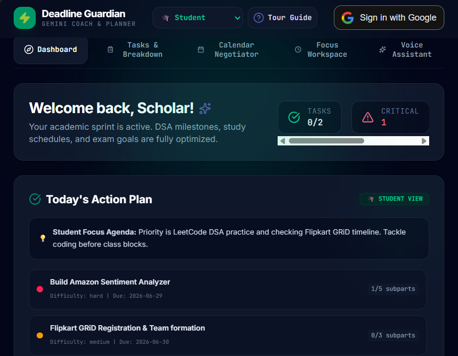
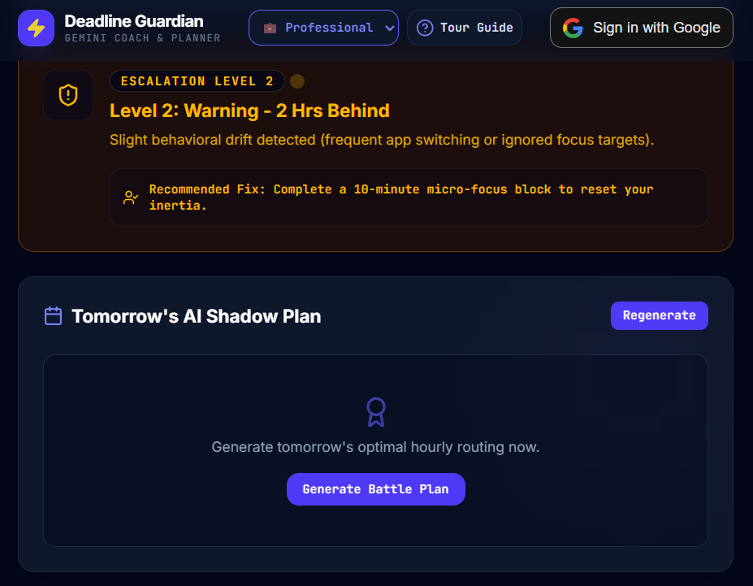
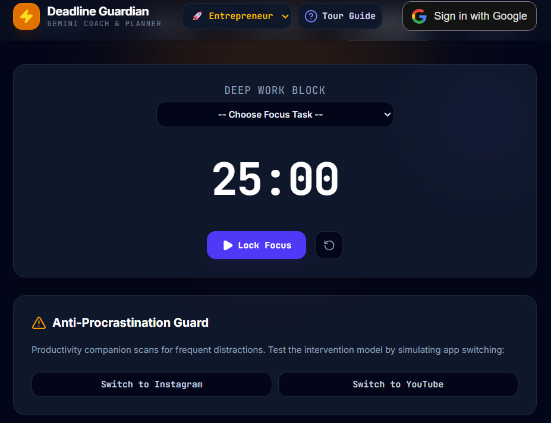
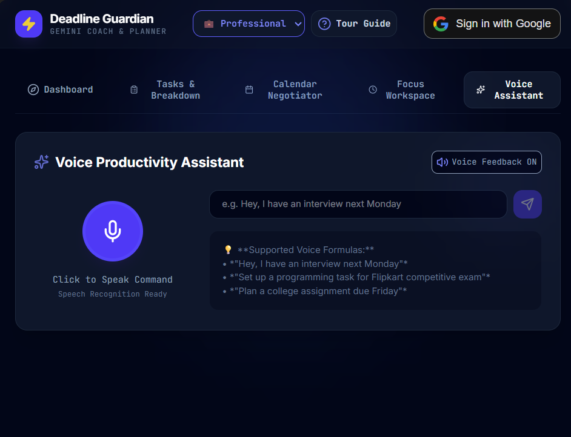
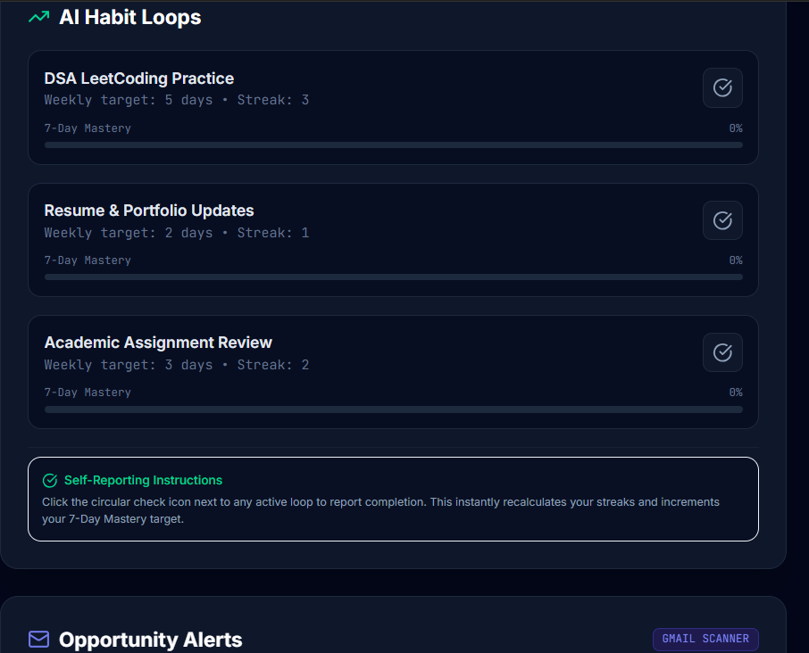

<div align="center">

# 🛡️ Deadline Guardian

### *Your AI-powered productivity companion that protects you from missed deadlines.*

<p align="center">
Helping students, professionals, and entrepreneurs stay ahead by planning, prioritizing, and completing tasks before deadlines are missed.
</p>


**Built for:** The Last-Minute Life Saver Hackathon

</div>

---

# 📖 Overview

Every day, thousands of students, professionals, and entrepreneurs miss important assignments, interviews, meetings, registrations, and bill payments.

The problem isn't forgetting.

The problem is that existing productivity apps simply notify users—they don't help them take action.

**Deadline Guardian** is an AI-powered productivity companion that proactively protects users from missed deadlines by planning work, prioritizing tasks, identifying risks, organizing schedules, and guiding users until their work is completed.

Instead of acting like a reminder app, Deadline Guardian acts like your personal AI productivity coach.

---

# 🎯 Problem Statement

Traditional productivity apps rely on passive reminders that are easy to dismiss.

Deadline Guardian solves this by providing:

- Intelligent task planning
- AI-powered prioritization
- Deadline risk prediction
- Personalized scheduling
- Opportunity detection
- Proactive productivity coaching

---

# ✨ Features

## 🧠 AI Task Planner

Transforms large goals into structured execution plans.

- Breaks complex projects into manageable subtasks
- Estimates effort required
- Prioritizes tasks intelligently
- Generates an actionable roadmap

---

## 🚨 Deadline Risk Engine

Every task is analyzed using AI to determine how likely it is to miss its deadline.

Risk Levels

🟢 Safe

🟡 At Risk

🔴 Critical

The Guardian automatically alerts users before the situation becomes critical.

---

## 🌙 AI Shadow Planner

Automatically prepares your day.

Creates a personalized battle plan containing:

- Priority tasks
- Suggested work schedule
- Estimated completion times
- Recommended focus sessions

---

## 📅 Smart Calendar Management

Helps organize work around existing commitments.

- Intelligent scheduling
- Priority-based planning
- Time-block suggestions
- Better workload distribution

---

## 📧 Opportunity Detector

Scans important information and identifies opportunities such as:

- Interviews
- Competitions
- Registrations
- Application deadlines
- Important commitments

Automatically converts them into actionable tasks.

---

## 🎙 Voice Assistant

Create and manage tasks naturally using voice commands.

Example:

> "I have an interview next Monday."

The AI automatically:

- Creates a task
- Estimates preparation time
- Builds a preparation schedule

---

## 🎯 Focus Workspace

Stay productive with:

- Pomodoro timer
- Progress tracking
- Distraction-free workspace
- AI-powered focus assistance

---

## 📊 Productivity Dashboard

Visualize everything in one place.

Includes:

- Upcoming deadlines
- Risk overview
- Productivity statistics
- Task completion progress
- AI recommendations

---

## 👥 Personalized Experience

Designed for:

- 🎓 Students
- 💼 Professionals
- 🚀 Entrepreneurs

Each experience is tailored with personalized recommendations.

---

# 🏗️ Architecture

```
                   Google Gemini AI
                          │
                          ▼
                 AI Decision Engine
                          │
        ┌─────────────────┼──────────────────┐
        ▼                 ▼                  ▼
 Task Planner      Deadline Engine     Opportunity Detector
        │                 │                  │
        └────────────┬────┴──────────────┐
                     ▼
             Productivity Dashboard
                     │
         ┌───────────┼────────────┐
         ▼           ▼            ▼
    Calendar     Voice AI     Focus Mode
                     │
                     ▼
              Firebase Backend
                     │
                     ▼
               Firestore Database
```

---

# 🛠 Tech Stack

### Frontend

- React
- TypeScript
- Vite

### Backend

- Firebase

### AI

- Google Gemini API

### Database

- Firestore

### Authentication

- Firebase Authentication

### Styling

- CSS

---

# ☁ Google Technologies Used

- ✅ Google Gemini API
- ✅ Firebase Authentication
- ✅ Cloud Firestore
- ✅ Firebase Hosting *(if deployed)*
- ✅ Google AI Studio

---

# 📂 Project Structure

```
src/
│
├── components/
│
├── services/
│
├── hooks/
│
├── contexts/
│
├── firebase/
│
├── App.tsx
│
└── main.tsx
```

---

# 🚀 Installation

Clone the repository

```bash
git clone https://github.com/yourusername/deadline guardian
```

Move into the project

```bash
cd deadline guardian
```

Install dependencies

```bash
npm install
```

Start development server

```bash
npm run dev
```

Create production build

```bash
npm run build
```

---

# 🔑 Environment Variables

Create a `.env` file.

```
GEMINI_API_KEY=YOUR_API_KEY

VITE_FIREBASE_API_KEY=

VITE_FIREBASE_AUTH_DOMAIN=

VITE_FIREBASE_PROJECT_ID=

VITE_FIREBASE_STORAGE_BUCKET=

VITE_FIREBASE_MESSAGING_SENDER_ID=

VITE_FIREBASE_APP_ID=
```

---

# 📸 Screenshots

| Dashboard | AI Planner |
|-----------|------------|
|  |  |

| Calendar | Focus Workspace |
|-----------|----------------|
|  |  |

| Voice Assistant | Opportunity Detector |
|----------------|----------------------|
|  |  |

---

# 🌟 Why Deadline Guardian?

Unlike traditional reminder apps, Deadline Guardian doesn't wait until you're late.

It proactively:

- Predicts deadline risks
- Creates execution plans
- Organizes schedules
- Detects opportunities
- Guides users through completion
- Helps users make better decisions

**It doesn't just remind you—it helps you finish.**

---

# 🎯 Future Vision

Deadline Guardian aims to become an intelligent AI productivity ecosystem capable of assisting users across academics, careers, business, and personal life through proactive planning and autonomous execution.

---

# 📄 License

Licensed under the MIT License.

---

<div align="center">

### 🛡️ Deadline Guardian

### *Protecting Your Time. Securing Your Success.*

Made with ❤️ using React, Firebase & Google Gemini AI.

</div>